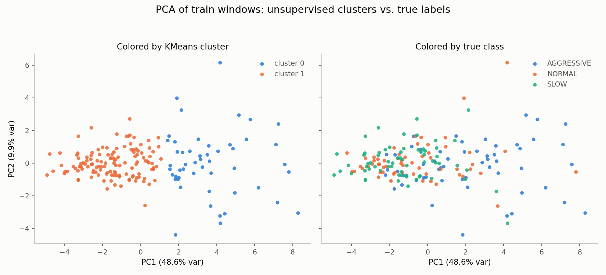
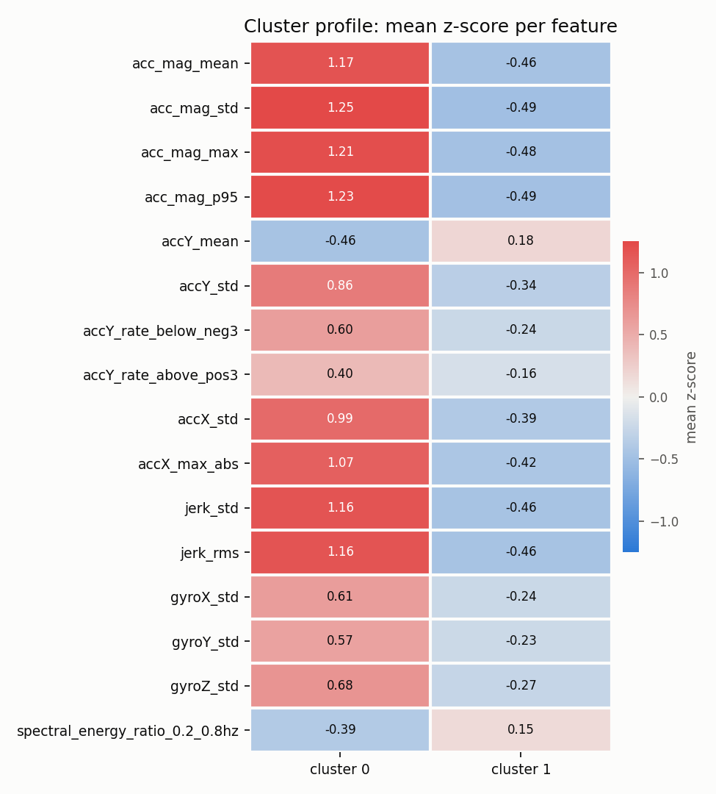
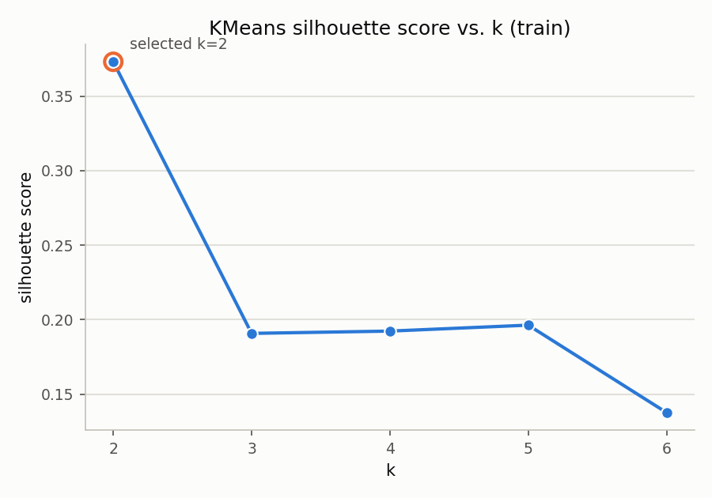
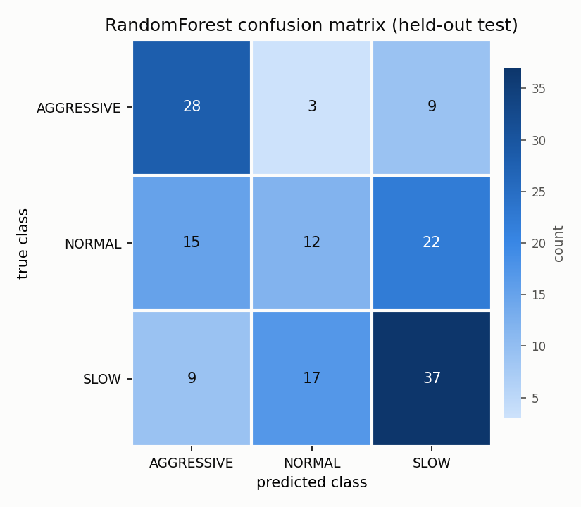

# Fleet Insights

This project asks whether unsupervised clustering can recover driving-behavior
categories (SLOW, NORMAL, AGGRESSIVE) from raw phone accelerometer and
gyroscope readings, and builds the supporting pipeline end to end: window
feature extraction, KMeans clustering with a supervised sanity check,
an LLM-generated narrative brief, static report figures, and a FastAPI
service that scores new CSV uploads against the saved model. The honest
answer, detailed below, is that clustering recovers a driving-intensity axis
that only partly lines up with the three labeled classes.

## Pipeline

```
data/driving_behavior_v2/{train,test}_motion_data.csv
            |
            v
  scripts/build_features.py        (src/features.py)
            |  window features, one row per 20-sample window
            v
  data/processed/windows_{train,test}.parquet
            |
            v
  scripts/run_clustering.py        (src/clustering.py)
            |  StandardScaler + KMeans fit on train only
            v
  models/scaler.joblib, models/kmeans.joblib
  reports/cluster_profile.csv
            |
            +--> scripts/diagnostics.py     supervised RandomForest check, k=3 comparison
            +--> scripts/make_figures.py    reports/figures/*.png
            +--> scripts/generate_report.py (src/genai_report.py, Anthropic API)
                     |
                     v
            reports/fleet_brief.json / .md
            |
            v
  src/api.py (FastAPI): serves the saved scaler + KMeans + brief
  generator over HTTP for new CSV uploads
```

## Key results

- Silhouette score selects **k = 2** for KMeans: 0.373 at k=2, versus about
  0.19 at k=3 through k=5 and 0.14 at k=6.
- The unsupervised structure recovers a single acceleration-intensity axis,
  not the dataset's three-class taxonomy. Adjusted Rand Index on held-out
  test windows is **0.12**.
- A supervised RandomForest trained on the same features scores **macro F1
  0.49** on the held-out test set, against a 0.195 majority-class baseline.
  The features carry real signal, so the ARI result is a geometric mismatch
  between the clusters and the label boundaries, not a sign that the
  features are uninformative.
- NORMAL and SLOW are not separable from inertial data alone: that
  distinction lives in vehicle speed, which accelerometers and gyroscopes do
  not measure. AGGRESSIVE, by contrast, is genuinely distinguishable from
  the other two on almost every feature.
- The PCA figure below makes the mismatch visible directly: KMeans splits
  cleanly along PC1 (48.6% of variance), while the three true classes
  overlap heavily on that same axis.

Full derivation, the k=3 comparison, and the per-feature separation table
are in [`reports/clustering_findings.md`](reports/clustering_findings.md).

## Figures

**PCA: KMeans clusters vs. true classes on the same points**



**Cluster profile: mean z-score per feature**



**Silhouette score vs. k**



**RandomForest confusion matrix on the held-out test set**



## Dataset selection

The project started from `sensor_raw.csv`. That file had no timestamp
column, so sampling gaps and trip boundaries could not be detected, and rows
were sorted by class with no way to verify recording order. The project
switched to `data/driving_behavior_v2/` (Kaggle `outofskills/driving-behavior`)
before building the pipeline: it has real per-row timestamps and a
pre-existing train/test split that looks session-level rather than shuffled.
It carries its own limitations, listed below, that carry through the rest
of this project. Full comparison and reasoning:
[`docs/data_selection.md`](docs/data_selection.md).

## API

`src/api.py` is a FastAPI service that scores a CSV upload against the
saved clustering model.

- `GET /health` returns `{"status": "ok"}`.
- `POST /analyse?use_llm=true` accepts a multipart CSV upload (field name
  `file`) with columns `AccX, AccY, AccZ, GyroX, GyroY, GyroZ, Timestamp`
  (`Class` optional). It returns per-window cluster assignments, a
  cluster-size summary, and the LLM brief. Malformed input returns a 422
  with a message describing the problem. `use_llm=false`, a missing
  `ANTHROPIC_API_KEY`, or a failed LLM call all fall back to numeric-only
  results, with a `notice` field explaining why.

Start it:

```
scripts/run_api.sh
```

Example requests:

```
curl http://localhost:8000/health

curl -X POST "http://localhost:8000/analyse?use_llm=false" \
  -F "file=@data/sample/sample_input.csv"

curl -X POST http://localhost:8000/analyse \
  -F "file=@data/sample/sample_input.csv"
```

`data/sample/sample_input.csv` is 60 rows carved directly from
`test_motion_data.csv`, the held-out split the clustering model never saw
during fitting.

## Quickstart

```
python3 -m venv .venv
.venv/bin/pip install -r requirements.txt

.venv/bin/python scripts/build_features.py
.venv/bin/python scripts/run_clustering.py
.venv/bin/python scripts/generate_report.py        # needs ANTHROPIC_API_KEY in .env
.venv/bin/python scripts/generate_report.py --mock  # no key needed, uses the stored example

scripts/run_api.sh
```

`scripts/make_figures.py` regenerates the four PNGs in `reports/figures/`
from the same pipeline; run it after `run_clustering.py` if you want fresh
copies.

If plain `python` / `pip` on your PATH resolve to something unexpected,
invoke `.venv/bin/python` / `.venv/bin/pip` directly, as above.

## Limitations

- No vehicle or driver identifier exists in this dataset -- clusters cannot
  be attributed to a specific car or driver, and no multi-vehicle or
  cross-driver generalization claim can be made.
- Each behavior class (SLOW / NORMAL / AGGRESSIVE) was recorded as a single
  continuous session, not a pool of independent trips, so these results
  describe the sessions actually recorded, not a broader population.
- Inertial sensors (accelerometer/gyroscope) cannot separate NORMAL from
  SLOW driving, because that distinction lives in vehicle speed, which
  these sensors do not measure -- not in acceleration or rotation.
